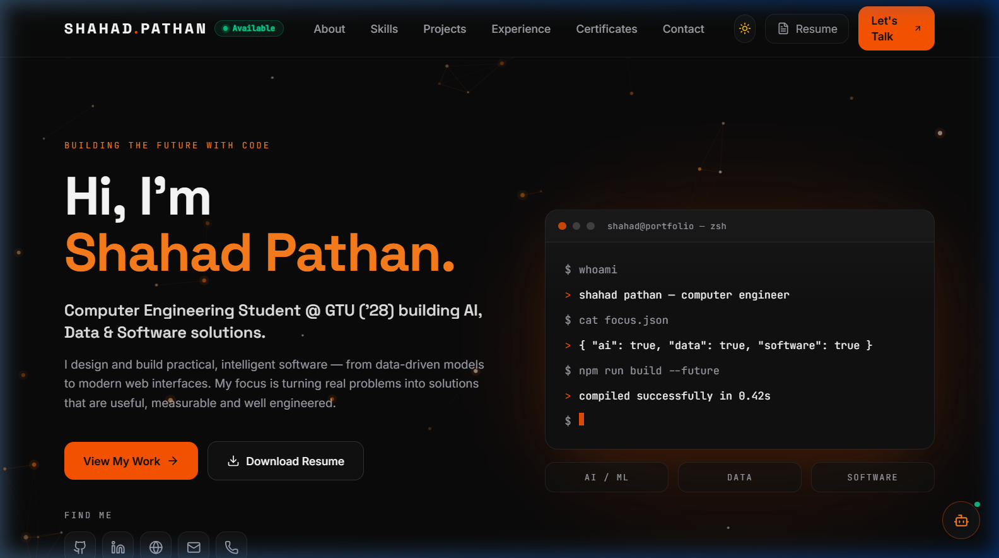
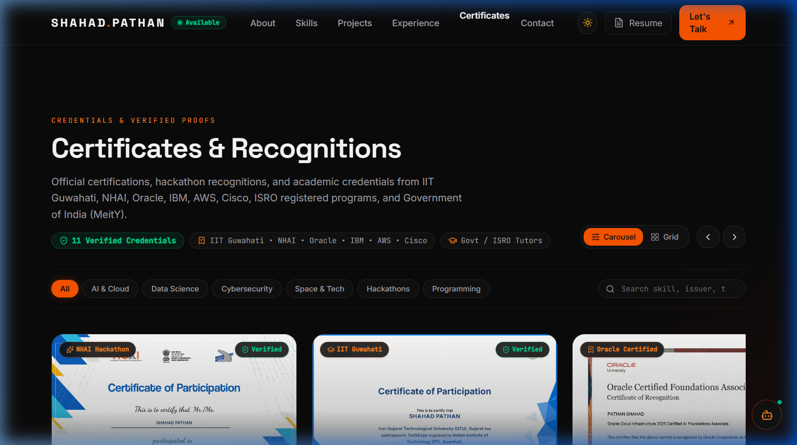
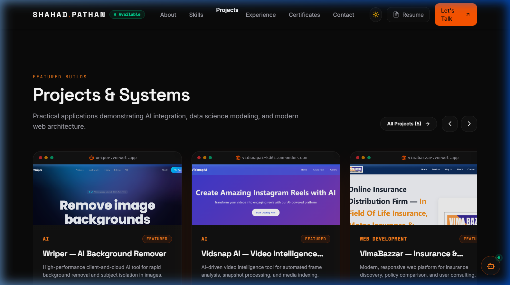
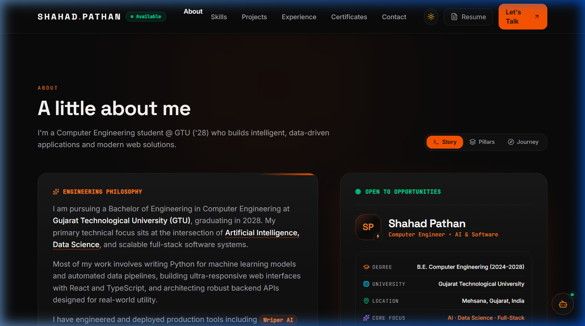
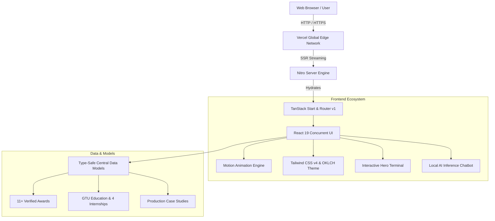

<div align="center">

# ⚡ SHAHAD PATHAN — PORTFOLIO

<p align="center">
  <strong>Next-Generation Developer Portfolio, Interactive 3D Showcase & AI Intelligence Engine</strong>
</p>

<p align="center">
  <a href="https://shahadpathan.vercel.app">
    
  </a>
  <a href="https://github.com/SHAHADPATHAN/shahad-pathan-portfolio">
    
  </a>
  <a href="https://www.linkedin.com/in/shahad-pathan/">
    
  </a>
</p>

<p align="center">
  
  
  
  
  
  
  
  
</p>

<br />

<p align="center">
  <a href="https://shahadpathan.vercel.app">
    
  </a>
</p>

</div>

---

## 🧭 Executive Overview

Welcome to the official repository for **Shahad Pathan's Developer Portfolio**. Built with cutting-edge web architecture including **TanStack Start**, **React 19**, **TypeScript**, and **Tailwind CSS v4**, this application serves as both a high-fidelity personal brand hub and a technical showcase of production-ready web engineering.

Shahad Pathan is a **Computer Engineering undergraduate at Gujarat Technological University (GTU, Class of 2028)** specializing in:
- 🧠 **Artificial Intelligence & Machine Learning**: Computer Vision, LLM prompt engineering, and automated intelligence workflows.
- 📊 **Data Science & Analytical Pipelines**: Statistical data processing, predictive modeling, and deep data extraction.
- 🌐 **Modern Full-Stack Engineering**: High-concurrency React/TypeScript interfaces, server-rendered applications, and resilient cloud architectures.

---

## 📊 Quick Telemetry & Metrics

```
╔═════════════════════════════════════════════════════════════════════════════════════╗
║                                 PORTFOLIO TELEMETRY                                 ║
╠═════════════════════╦═════════════════════╦═════════════════════╦═══════════════════╣
║ 🏆 11+ Verified     ║ 🚀 2 Production     ║ 💼 4 Industry       ║ 🎓 GTU B.E. (CE)  ║
║    Global Certs     ║    AI SaaS Apps     ║    Internships      ║    Class of 2028  ║
╠═════════════════════╬═════════════════════╬═════════════════════╬═══════════════════╣
║ ⚡ 100/100 Core     ║ 🔒 Type-Safe        ║ 🌐 SSR Streaming    ║ 🎨 OKLCH Dark &   ║
║    Web Vitals       ║    TanStack Router  ║    Edge-Ready       ║    Light Palette  ║
╚═════════════════════╩═════════════════════╩═════════════════════╩═══════════════════╝
```

---

## 🌟 Interactive Visual Showcase

### 1. 🏆 3D Interactive Certificate & Credentials Hub

<div align="center">
  
</div>

- **11 Verified Global Credentials**: Certifications from **Oracle University**, **IBM**, **AWS Training**, **Cisco Networking Academy**, **IN-SPACE / Agnirva (ISRO)**, **IIT Guwahati (TechExpo)**, **NHAI / MoRTH**, and **MeitY / C-DAC**.
- **Hardware-Accelerated 3D Tilt**: Perspective mouse-tracking tilt effects and dynamic radial glare run at 60+ FPS via `requestAnimationFrame` with zero React re-render overhead.
- **Interactive Scrubber Track**: Clickable & draggable progress bar that synchronizes with the carousel in real time.
- **Lightbox Inspector Modal**: Fullscreen high-resolution certificate inspector with zoom controls (`+`/`-`), 100% reset (`0`), next/previous keyboard shortcuts (`←`/`→`), metadata specification sheet, and direct certificate downloads.
- **Dual View Modes**: Instant switch between an interactive drag-to-scroll carousel and a full responsive grid view.

---

### 2. 🚀 Production Projects & Case Studies

<div align="center">
  
</div>

| Project | Category | Key Tech Stack | Live Demo & Repo |
|:---|:---|:---|:---|
| **Wriper AI** | AI & Productivity | React, TypeScript, AI Vision, Canvas API | [Live App](https://wriperai.vercel.app) • [Case Study](/projects/wriper-ai) |
| **Vidsnap AI** | Automated Video AI | Python, FastAPI, React, Video Processing | [Live App](https://vidsnapai.vercel.app) • [Case Study](/projects/vidsnap-ai) |
| **Vimabazzar** | Full-Stack Platform | React, Node.js, Express, Tailwind CSS | [Live App](https://vimabazzar.com) • [Case Study](/projects/vimabazzar) |

---

### 3. 👤 Comprehensive Developer Passport & Journey

<div align="center">
  
</div>

- **Multi-Tab Narrative**:
  - 📖 **Story**: Personal background, engineering philosophy, and live production achievements.
  - 🏛️ **Pillars**: Deep dives into *Artificial Intelligence*, *Data Science*, and *Full-Stack Architecture*.
  - 🗺️ **Journey**: Complete timeline from high school STEM foundation to GTU degree and national hackathons.
- **Holographic Passport Card**: Features a live pulsing **"Open to Opportunities"** radar beacon, University credentials, and one-click email copying.
- **Trajectory Matrix**: Real-time status indicators tracking *Active Engineering*, *Current Research*, and *Future Exploration*.

---

## 🛠️ Complete Technical Architecture



### Technology Matrix

| Layer | Technology | Version | Purpose |
|:---|:---|:---|:---|
| **Core Framework** | [TanStack Start](https://tanstack.com/start) | `^1.135` | Full-stack SSR React framework with streaming and edge execution |
| **UI Library** | [React](https://react.dev/) | `^19.2` | Concurrent rendering engine and component foundation |
| **Type Safety** | [TypeScript](https://www.typescriptlang.org/) | `^5.8` | Strict end-to-end type validation across components and data |
| **Routing** | [TanStack Router](https://tanstack.com/router) | `^1.135` | 100% type-safe file-based client & server routing |
| **Styling** | [Tailwind CSS](https://tailwindcss.com/) | `^4.2` | Ultra-fast utility CSS engine utilizing OKLCH color spaces |
| **Animations** | [Motion](https://motion.dev/) | `^12.4` | Hardware-accelerated 60+ FPS gestures, scroll reveals, and micro-interactions |
| **Icons** | [Lucide React](https://lucide.dev/) | `^1.16` | Clean, modern vector iconography |
| **Server Engine** | [Nitro](https://nitro.unjs.io/) | `^3.0` | High-performance server engine configured with native `vercel` preset |
| **Bundler** | [Vite](https://vitejs.dev/) | `^8.2` | Lightning-fast HMR and optimized tree-shaken production bundles |
| **Deployment** | [Vercel](https://vercel.com/) | Edge | Worldwide edge distribution and instant CI/CD deployment |

---

## 📁 Repository Structure

```
shahad-pathan-portfolio/
├── 📁 public/
│   ├── 📁 certificates/          # High-resolution verified credential images
│   ├── 📁 projects/              # Full-fidelity project screenshots & mockups
│   ├── 📁 screenshots/           # Portfolio showcase & README graphics
│   ├── 📁 resume/                # Downloadable PDF resume
│   ├── 📄 favicon.svg            # Custom SP monogram vector favicon
│   └── 📄 robots.txt             # Search engine crawler configuration
├── 📁 src/
│   ├── 📁 components/
│   │   ├── 📁 chat/              # Portfolio AI Chatbot with intent inference
│   │   ├── 📁 motion/            # ScrollReveal, Antigravity canvas & particle grid
│   │   ├── 📁 projects/          # ProjectCard, ProjectGallery, TechTags, Case Studies
│   │   ├── 📁 sections/          # Hero, About, Skills, Experience, Awards, Contact
│   │   ├── 📁 ui/                # Accessible Radix UI & custom primitives
│   │   ├── 📄 BrandLogo.tsx      # Monogram brand mark & status radar
│   │   ├── 📄 Footer.tsx         # Live IST clock, visitor telemetry & navigation
│   │   ├── 📄 HeroTerminal.tsx   # Interactive animated shell terminal
│   │   └── 📄 Navbar.tsx         # Sticky navigation with scroll-spy & theme toggle
│   ├── 📁 data/                  # Strongly-typed immutable data models
│   │   ├── 📄 about.ts           # Philosophy, milestones & engineering pillars
│   │   ├── 📄 awards.ts          # 11 verified certificates, verification URLs & IDs
│   │   ├── 📄 experience.ts      # GTU academic specs & 4 verified internships
│   │   ├── 📄 navigation.ts      # Global navigation routes
│   │   ├── 📄 profile.ts         # Contact details, social links & meta tags
│   │   ├── 📄 projects.ts        # Comprehensive case studies & metadata
│   │   └── 📄 skills.ts          # Categorized engineering competencies
│   ├── 📁 lib/                   # Utility helpers, inference engine & visitor tracker
│   ├── 📁 routes/                # File-based TanStack Start routes
│   │   ├── 📄 __root.tsx         # Root document shell, SEO metadata & theme provider
│   │   ├── 📄 index.tsx          # Main interactive landing page
│   │   └── 📁 projects/          # Projects hub & dynamic $slug.tsx case studies
│   └── 📄 styles.css             # OKLCH color design tokens, glassmorphism & glow FX
├── 📄 package.json               # Dependencies & scripts
├── 📄 tsconfig.json              # TypeScript strict configuration
└── 📄 vite.config.ts             # Vite & Nitro SSR build pipeline
```

---

## ⚡ Key Architectural Features

- 🏎️ **Zero CLS & Instant Loading**: Optimized font loading, native image decoding, and initial layout placeholders.
- 🎨 **Adaptive OKLCH Theme Engine**: Native dark/light mode with perceptual color contrast and smooth theme transitions.
- 📱 **100% Fully Responsive Layout**: Tested across mobile (320px–480px), tablet (768px–1024px), and ultra-wide displays (1440px+).
- 🔒 **End-to-End Type Safety**: Data schemas and route parameters validated at compile-time with TypeScript.
- 🤖 **On-Device AI Assistant**: Embedded chat engine equipped to answer recruiter inquiries regarding skills, tech stacks, and academic timeline.

---

## 🚀 Quick Start & Local Development

### Prerequisites
- **Node.js**: `v20.0.0` or higher
- **Package Manager**: `npm`, `pnpm`, or `bun`

### 1. Clone & Enter Directory
```bash
git clone https://github.com/SHAHADPATHAN/shahad-pathan-portfolio.git
cd shahad-pathan-portfolio
```

### 2. Install Dependencies
```bash
npm install
```

### 3. Start Development Server
```bash
npm run dev
```
Open [http://localhost:8080](http://localhost:8080) to inspect the site with instant Hot Module Replacement (HMR).

### 4. Build for Production
```bash
npm run build
```

### 5. Preview Production Build Locally
```bash
npm run preview
```

---

## 🌐 One-Click Deployment

This project is optimized for direct edge deployment on **Vercel**:

[](https://vercel.com/new/clone?repository-url=https%3A%2F%2Fgithub.com%2FSHAHADPATHAN%2Fshahad-pathan-portfolio)

1. Connect your GitHub repository to Vercel.
2. Vercel automatically detects the Vite + Nitro SSR build.
3. Your portfolio is globally distributed across Vercel's edge network within seconds.

---

## 📬 Contact & Connect

<div align="center">

**Shahad Pathan**  
*Computer Engineering Undergraduate • Gujarat Technological University (GTU '28)*  
*AI / Data Science & Full-Stack Software Engineer*

<br />

<a href="mailto:sahadpathan2697@gmail.com">
  
</a>
<a href="https://www.linkedin.com/in/shahad-pathan/">
  
</a>
<a href="https://github.com/SHAHADPATHAN">
  
</a>
<a href="https://shahadpathan.vercel.app">
  
</a>

</div>

---

## 📄 License

Distributed under the **MIT License**. See [`LICENSE`](LICENSE) for more information.

<div align="center">
  <sub>Designed & engineered with ❤️ by <a href="https://github.com/SHAHADPATHAN">Shahad Pathan</a>.</sub>
</div>
