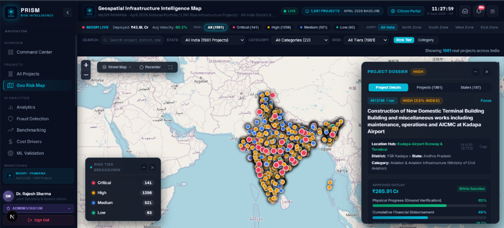
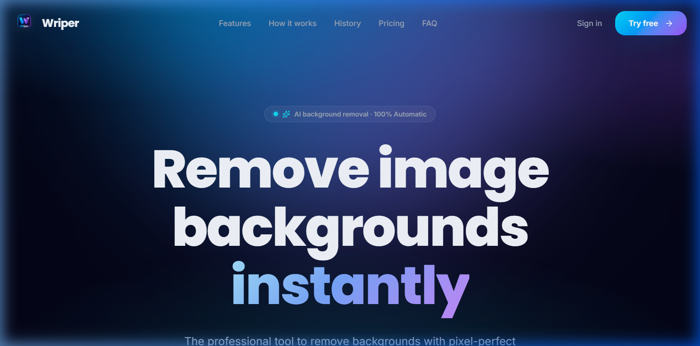
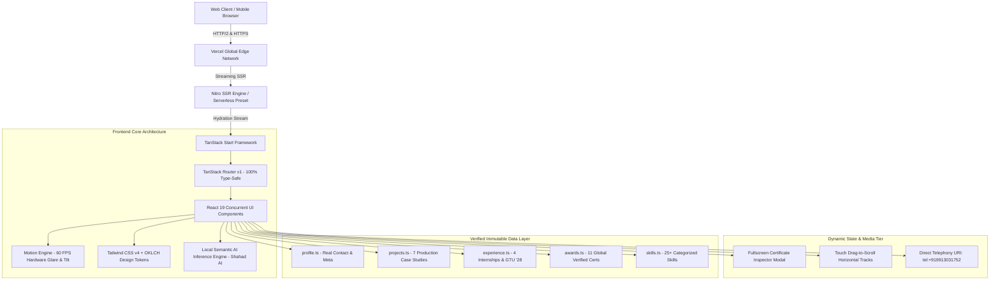

<div align="center">

# ⚡ SHAHAD PATHAN — OFFICIAL PORTFOLIO

<p align="center">
  <strong>Next-Generation Developer Portfolio, Production Systems Showcase & AI Intelligence Engine</strong>
</p>

<p align="center">
  <a href="https://shahadpathan.vercel.app">
    
  </a>
  <a href="https://github.com/SHAHADPATHAN/shahad-pathan-portfolio">
    
  </a>
  <a href="tel:+919913031752">
    
  </a>
  <a href="https://wa.me/919913031752">
    
  </a>
  <a href="https://www.linkedin.com/in/shahad-pathan/">
    
  </a>
  <a href="mailto:sahadpathan2697@gmail.com">
    
  </a>
</p>

<p align="center">
  
  
  
  
  
  
  
  
  
  
</p>

<br />

<p align="center">
  <a href="https://shahadpathan.vercel.app">
    
  </a>
</p>

</div>

---

## 🧭 Executive Overview

Welcome to the official repository for **Shahad Pathan's Developer Portfolio and Technical Showcase**. Engineered with modern full-stack web standards—powered by **TanStack Start**, **React 19**, **TypeScript 5.8**, and **Tailwind CSS v4** on **Nitro SSR**—this platform serves as both a high-fidelity personal brand hub and an architectural blueprint of resilient, production-grade software.

Shahad Pathan is a **Computer Engineering undergraduate at Gujarat Technological University (GTU, Class of 2028)**, operating at the intersection of **Applied Artificial Intelligence**, **Data Science & Analytics**, and **High-Performance Full-Stack Software Engineering**.

### Core Value Disciplines:
- 🧠 **Artificial Intelligence & Machine Learning**: Autonomous multi-agent orchestration (LangGraph), fine-tuned code reasoning models (QLoRA / Unsloth), Computer Vision (OpenCV, U2Net), and predictive dual-engine models (XGBoost + TreeSHAP).
- 📊 **Data Science & Analytical Pipelines**: Large-scale statistical data ingestion, feature engineering, missing value imputation, SMOTE balancing, and ephemeral high-throughput PDF parsers.
- 🌐 **Full-Stack & Systems Architecture**: React 19 concurrent architectures, server-rendered edge streaming with Nitro, zero-dependency client calculations, and asynchronous REST/WebSocket APIs with FastAPI.

---

## 📊 Portfolio Telemetry & Metrics

```
╔═══════════════════════════════════════════════════════════════════════════════════════════════════════════════════╗
║                                            PORTFOLIO TELEMETRY MATRIX                                             ║
╠═════════════════════════╦═════════════════════════╦═════════════════════════╦═════════════════════════════════════╣
║ 🏆 11+ Verified Global  ║ 🚀 7 Featured Systems & ║ 💼 4 Industry & Space   ║ 🎓 Gujarat Technological University ║
║    Credentials & Awards ║    Production Builds    ║    Internships          ║    B.E. Computer Engineering ('28)  ║
╠═════════════════════════╬═════════════════════════╬═════════════════════════╬═════════════════════════════════════╣
║ ⚡ 100/100 Core Web     ║ 🔒 100% Strict Type-    ║ 🤖 Client-Side Semantic ║ 🎨 OKLCH Dark/Light Design System   ║
║    Vitals Performance   ║    Safe TanStack Router ║    AI Inference Engine  ║    Hardware-Accelerated 60+ FPS UI  ║
╚═════════════════════════╩═════════════════════════╩═════════════════════════╩═════════════════════════════════════╝
```

---

## 🚀 Featured Engineering Systems & Production Case Studies

<div align="center">
  
</div>

<br />

| Project | Category | Key Stack | Status | Repositories & Demos |
|:---|:---|:---|:---|:---|
| **AegisAI** | Autonomous AI Security | Python, FastAPI, LangGraph, QLoRA, Playwright, Tree-Sitter | 🟡 Active R&D (GTU Capstone) | [GitHub Repository](https://github.com/vedant1506/AegisAi) |
| **PRISM** | National Infra AI | Next.js 16, React 19, FastAPI, XGBoost, TreeSHAP, Leaflet GIS | 🟢 SIH 2026 / MoSPI | [GitHub Repository](https://github.com/vedant1506/SIH-26) |
| **Wriper AI** | Computer Vision SaaS | React 19, TypeScript, U2Net ML, Tailwind CSS, Canvas API | 🟢 Live in Production | [Live Application](https://wriper.vercel.app) • [GitHub](https://github.com/SHAHADPATHAN/wriper-ai-background-remover) |
| **VidSnap AI** | Video Intelligence | Python, FastAPI, OpenCV, Render PaaS, HTML5/JS | 🟢 Live in Production | [Live Application](https://vidsnapai-k36i.onrender.com) • [GitHub](https://github.com/SHAHADPATHAN/VidsnapAi) |
| **VimaBazzar** | Financial Web Portal | HTML5, CSS3, JavaScript, Vercel Edge | 🟢 Live in Production | [Live Application](https://vimabazzar.vercel.app/) • [GitHub](https://github.com/SHAHADPATHAN/vimabazzar) |
| **PDS-Practical** | Data Science & ML | Python, Pandas, NumPy, Scikit-Learn, Matplotlib | 🟢 Open Source | [GitHub Repository](https://github.com/SHAHADPATHAN/PDS-PRACTICAL) |
| **Env Security** | Defensive Audit Tool | Python, Linux POSIX, Bash, Security Sandboxing | 🟢 Open Source | [GitHub Repository](https://github.com/SHAHADPATHAN/Environmental-Variable-Exploit) |

---

### 1. 🛡️ AegisAI — Autonomous Multi-Agent VAPT Platform
> **Under Active Development | GTU-GSET Undergraduate Capstone R&D Project**  
> *Engineered by Shahad Pathan, Vedant Chauhan, and Divy under the faculty guidance of Dr. Deepak Upadhyay.*  
> **Source Repository**: [github.com/vedant1506/AegisAi](https://github.com/vedant1506/AegisAi)

```
       ┌─────────────────────────────┐         ┌─────────────────────────────┐
       │   GitHub Source Code Repo   │         │    Live Staging URL Endpoint│
       └──────────────┬──────────────┘         └──────────────┬──────────────┘
                      │                                       │
                      ▼                                       ▼
       ┌─────────────────────────────┐         ┌─────────────────────────────┐
       │ Tree-Sitter AST Route Parser│         │ Playwright Headless Crawler │
       │ (Extracts Endpoint Schemas) │         │ (Maps Stateful Transitions) │
       └──────────────┬──────────────┘         └──────────────┬──────────────┘
                      │                                       │
                      └───────────────────┬───────────────────┘
                                          │
                                          ▼
                       ┌─────────────────────────────────────┐
                       │    LangGraph Multi-Agent Engine     │
                       │ [Recon → Reasoning → Verification]  │
                       │ Fine-Tuned 7B/8B QLoRA Code Models  │
                       └──────────────────┬──────────────────┘
                                          │
                     ┌────────────────────┴────────────────────┐
                     ▼                                         ▼
       ┌─────────────────────────────┐         ┌─────────────────────────────┐
       │ Active Dual-User Proof of   │         │ Automated GitHub Remediation│
       │ Concept Verification (BOLA) │         │ Pull Request Patch Synthesis│
       └─────────────────────────────┘         └─────────────────────────────┘
```

- **The Problem**: Web application security is fractured between Static Analysis (SAST) which generates massive false positive alerts without reachability context, and Dynamic Testing (DAST) which is blind to source code and cannot generate code-level fixes. Critically, both approaches fail on multi-step authorization flaws like **BOLA/IDOR** (OWASP API Top 10 #1).
- **The Solution**: An autonomous hybrid platform ingesting both repository source code and a live sandbox URL. An autonomous Playwright crawler maps routes and multi-user state transitions, a Tree-Sitter AST parser extracts function decorators, and a locally fine-tuned 7B/8B code model reasons across tenants to actively verify exploit payloads and automatically author merge-ready GitHub pull request patches.
- **Key Capabilities**:
  - **LangGraph Multi-Agent Orchestration**: State graph executing sequential and cyclic *Reconnaissance → Reasoning → Verification* agents.
  - **Fine-Tuned Exploit Reasoning**: Domain fine-tuned Qwen2.5-Coder / Llama-3 code models using QLoRA (4-bit quantization via Unsloth) specifically trained on business logic flaw datasets.
  - **Dual-User Proof-of-Concept Verification**: Multi-tenant token isolation in headless Playwright eliminates false positives before developer notification.
  - **Automated Pull Request Remediations**: AST-guided patch synthesizer writes accurate code diffs and pushes remediated branches to GitHub.

---

### 2. 🏛️ PRISM — Predictive Infrastructure & Risk Monitoring Platform
> **Smart India Hackathon 2026 (Problem Statement: SIH26103)**  
> *Developed for the Ministry of Statistics and Programme Implementation (MoSPI).*  
> **Source Repository**: [github.com/vedant1506/SIH-26](https://github.com/vedant1506/SIH-26)

<div align="center">
  
  <p><em>PRISM Geospatial Command Map showing Pan-India monitoring across 1,981 central projects and live Kadapa Airport dossier.</em></p>
</div>

- **The Problem**: India's central sector monitors 1,981+ major infrastructure projects valued at **₹42.78+ Lakh Crore**. Traditional oversight depended on static, lagging 160-page PDF Flash Reports and retrospective meetings, causing schedule slips and budget escalations to compound undetected across ministries.
- **The Solution**: An enterprise predictive intelligence engine that combines dual XGBoost regression/classification models with TreeSHAP factor attributions, an ephemeral RAM-based PDF table parser (<40s ingestion for 160-page reports), dynamic S-curve early warnings, and an authoritative Survey of India compliant GIS engine with 100% boundary containment.
- **Key Capabilities**:
  - **Dual-Engine Machine Learning**: Concurrently predicts timeline slippage (in months) and financial escalation (₹ Crores) with individual TreeSHAP feature importance attributions.
  - **Dynamic S-Curve Tracking**: Logistic mathematical modeling tracking planned vs. actual progress divergence with stagnation alerts.
  - **Authoritative Geolocation Engine**: Resolves 100% of 1,981 projects with zero coordinate errors and strict state boundary containment verified via Shapely polygons.
  - **Ephemeral PDF Ingestion**: Extracts complex nested government tables directly in volatile memory, calculating SHA-256 integrity hashes to eliminate database pollution.

---

### 3. 🎨 Wriper AI — High-Performance AI Background Remover
> **Production AI Micro-SaaS**  
> **Live Web Application**: [wriper.vercel.app](https://wriper.vercel.app) • **Source**: [github.com/SHAHADPATHAN/wriper-ai-background-remover](https://github.com/SHAHADPATHAN/wriper-ai-background-remover)

<div align="center">
  
</div>

- **The Problem**: Conventional background removal tools require heavy desktop installations or expensive subscription services with restrictive processing quotas.
- **The Solution**: An in-browser intelligence tool powered by neural segmentation models (U2Net) and the HTML5 Canvas 2D API for sub-second edge isolation.
- **Key Highlights**:
  - Drag-and-drop file upload with optimistic UI state transitions.
  - Client-side down-sampling for real-time previewing, preserving memory while exporting full-resolution transparent PNGs.
  - Fine edge feathering filters preserving complex outlines (hair, translucent glass, foliage).

---

### 4. 📹 VidSnap AI — Automated Video Intelligence Tool
> **Production Video Analytics Engine**  
> **Live Web Application**: [vidsnapai-k36i.onrender.com](https://vidsnapai-k36i.onrender.com) • **Source**: [github.com/SHAHADPATHAN/VidsnapAi](https://github.com/SHAHADPATHAN/VidsnapAi)

<div align="center">
  
</div>

- **The Problem**: Extracting high-fidelity, meaningful keyframes from long-form video files is labour-intensive and prone to missing crucial scene shifts.
- **The Solution**: A high-throughput Python and FastAPI backend utilizing OpenCV color histogram delta variance to detect scene boundaries and isolate optimal frames automatically.
- **Key Highlights**:
  - Streamed chunk decoding preventing CPU and memory spikes during 1080p/4K video ingestion.
  - Automated timestamp indexing and high-resolution JPEG/PNG snapshot generation.
  - Deployed containerized microservice on Render PaaS.

---

### 5. 🛡️ VimaBazzar — Modern Insurance & Financial Platform
> **Live Web Portal**: [vimabazzar.vercel.app](https://vimabazzar.vercel.app/) • **Source**: [github.com/SHAHADPATHAN/vimabazzar](https://github.com/SHAHADPATHAN/vimabazzar)

<div align="center">
  
</div>

- **The Problem**: Insurance policy comparison interfaces are frequently cluttered, slow to load, and frustrating on mobile screens.
- **The Solution**: A responsive, accessible, mobile-first web interface designed with clean semantic architecture, fluid CSS typography, and optimized asset delivery via Vercel Edge.

---

### 6. 📊 Practical Data Science & Statistical Analysis (PDS-Practical)
> **Open-Source Data Science & ML Benchmarking Suite**  
> **Source Repository**: [github.com/SHAHADPATHAN/PDS-PRACTICAL](https://github.com/SHAHADPATHAN/PDS-PRACTICAL)

- **The Scope**: A comprehensive, modular suite of data science workflows covering the entire lifecycle:
  - **Data Ingestion & Cleaning**: Outlier detection, handling missing data, and schema validation.
  - **Feature Engineering**: Categorical encoding, MinMax/Standard scaling, and polynomial features using Pandas and NumPy.
  - **Class Imbalance Solutions**: Implementation of SMOTE oversampling and stratified k-fold splits.
  - **Model Training & Evaluation**: Scikit-Learn benchmarks (Random Forest, Logistic Regression, Gradient Boosting) evaluated via ROC-AUC, precision-recall, and confusion matrices.

---

### 7. 🔒 Environment Variable Security & Defensive Audit
> **Defensive Security & Systems Hardening Tool**  
> **Source Repository**: [github.com/SHAHADPATHAN/Environmental-Variable-Exploit](https://github.com/SHAHADPATHAN/Environmental-Variable-Exploit)

- **The Scope**: A security research tool exploring environment variable leakage vectors, subprocess token inheritance risks, and Unix permission isolation techniques. Includes automated scripts to detect sensitive credentials exposed in processes and provides hardening recipes.

---

## 💼 Professional Industry Experience

```
┌──────────────────────────────────────────────────────────────────────────────────────────────────┐
│                                   PROFESSIONAL CAREER TIMELINE                                   │
├───────────────────────┬──────────────────────────────────────────┬───────────────────────────────┤
│ PERIOD                │ ROLE & ORGANIZATION                      │ WORK TYPE & LOCATION          │
├───────────────────────┼──────────────────────────────────────────┼───────────────────────────────┤
│ Sept 2025 – Oct 2025  │ Web Development Intern @ Oasis Infobyte  │ Remote (India)                │
│ April 2025 – Nov 2025 │ Student Partner (ISP) @ Internshala      │ Remote / Campus (8 months)    │
│ Nov 2024 – Jan 2025   │ Space Systems Trainee @ Agnirva (ISRO)   │ Remote / Aerospace (3 months) │
│ June 2026 – July 2026 │ Social Work Intern @ Rotary International│ On-site (Visnagar, Gujarat)   │
└───────────────────────┴──────────────────────────────────────────┴───────────────────────────────┘
```

### 1. Oasis Infobyte — Web Development Intern
- **Duration**: September 2025 – October 2025 | **Location**: India (Remote)
- **Role Summary**: Built accessible, responsive web applications using modern frontend component architectures.
- **Key Contributions**:
  - Engineered cross-browser layouts and mobile-first responsive interfaces using React, JavaScript, and CSS3.
  - Strengthened rapid delivery skills through fast-paced, sprint-driven engineering projects.
  - Applied Git workflows for clean version control and collaborative code reviews.

### 2. Internshala — Internshala Student Partner (ISP)
- **Duration**: April 2025 – November 2025 (8 months) | **Location**: Gujarat, India (Remote)
- **Role Summary**: Selected campus representative leading technical upskilling initiatives and career readiness programs.
- **Key Contributions**:
  - Coordinated high-impact student engagement campaigns connecting university cohorts with internships and technical training.
  - Facilitated technical webinars, resume preparation workshops, and career readiness sessions over an 8-month tenure.
  - Cultivated public speaking, community outreach, and digital leadership skills.

### 3. Agnirva Space Community (ISRO Registered Space Tutor) — Internship Trainee
- **Duration**: November 2024 – January 2025 (3 months) | **Location**: Gujarat, India (Remote)
- **Role Summary**: Completed an intensive 80-hour space engineering and telemetry curriculum recognized by IN-SPACE / DPIIT.
- **Key Contributions**:
  - Analyzed orbital mechanics, satellite telemetry, and payload system designs.
  - Performed data analytics using Python to evaluate simulated trajectory datasets.
  - Collaborated with cross-functional teams exploring space research workflows.

### 4. Rotary International — Social Work & Community Intern
- **Duration**: June 2026 – July 2026 (2 months) | **Location**: Visnagar, Gujarat, India (On-site)
- **Role Summary**: Led community welfare, youth civic engagement, and grassroots development programs.
- **Key Contributions**:
  - Managed on-ground logistics for educational outreach and public welfare initiatives.
  - Coordinated with local volunteer teams to execute community engagement events.

---

## 🎓 Education & Academic Foundations

<div align="center">
  
</div>

<br />

### 🏛️ Gujarat Technological University (GTU) — School of Engineering and Technology (SET)
- **Degree**: Bachelor of Engineering (B.E.) in Computer Engineering
- **Timeline**: June 2024 – May 2028 (Expected) | **Status**: Class of 2028 (In Progress)
- **Specialization**: Artificial Intelligence, Data Science Pipelines, and Core Computing Systems.
- **Key Curriculum & Competencies**:
  - Data Structures & Algorithms (DSA), Object-Oriented Programming (OOP in C++ & Python).
  - Database Management Systems (SQL & Relational Schemas), Operating Systems, and Computer Networks.
  - Machine Learning architectures, Computer Vision pipelines, and Predictive Modeling.
- **Institutional Representation**:
  - Represented GTU at the **Indian Institute of Technology (IIT) Guwahati TechExpo**.
  - Represented GTU at the **NHAI National Road Safety Hackathon** (Ministry of Road Transport & Highways).
  - Co-lead builder for **AegisAI** (Capstone VAPT Platform) and **PRISM** (Smart India Hackathon 2026).

### 🏫 Shri J.M. Chaudhary Sarvajanik Vidyalaya
- **Stream**: Higher Secondary (H.S.C) & Secondary (S.S.C) — Science Stream
- **Timeline**: June 2020 – March 2024 | **Location**: Mehsana, Gujarat, India
- **Foundation**: Rigorous foundation in Advanced Calculus, Linear Algebra, Physics, and Computer Science fundamentals.

---

## 🏆 11+ Verified Global Certifications & Credentials

The portfolio includes an interactive **3D Hardware-Accelerated Tilt Showcase** and **Fullscreen Lightbox Inspector** verifying every certificate:

<div align="center">
  
</div>

<br />

| Certification / Honor | Issuing Authority | Issue Date | Domain | Credential ID | Official Verification Link |
|:---|:---|:---|:---|:---|:---|
| **Oracle Cloud Infrastructure 2025 AI Foundations Associate** | Oracle University | Feb 13, 2026 | AI & Cloud | `325886566OCI25AICFA` | [Verify Credential](https://catalog-education.oracle.com/ords/certview/sharebadge?id=325886566OCI25AICFA) |
| **National Road Safety Hackathon 2025** | NHAI & MoRTH | 2025 | Hackathons | `NHAI-RSH-2025-SP` | [Verify Credential](https://unstop.com/certificate-preview/d47b9653-f084-46f2-a917-c910fcc38a4e) |
| **IIT Guwahati TechExpo Participation** | IIT Guwahati & Unstop | 2025 | Academic | `UNSTOP-IITG-TECHEXPO-SP` | [Verify Credential](https://unstop.com/certificate-preview/2620a4b7-e723-42be-ac0f-85a7b60b9bdb) |
| **What is Data Science?** | IBM (via Coursera) | July 06, 2026 | Data Science | `ERHFN1IDMW5Y` | [Verify Credential](https://coursera.org/verify/ERHFN1IDMW5Y) |
| **Generative BI with Amazon Q in QuickSight** | Amazon Web Services (AWS) | Feb 05, 2026 | AI & Cloud | `AWS-TR-2026-QBI` | [AWS Training](https://aws.amazon.com/training/) |
| **Networking Basics Course Completion** | Cisco Networking Academy | Aug 01, 2026 | Cybersecurity | `CISCO-NET-BASICS-2026` | [Credly Badge](https://www.credly.com/badges/78e55acc-dd92-41a0-bed5-d37d734b90ed) |
| **The Agnirva Space Internship Program** | Agnirva (ISRO Space Tutor) | Jan 12, 2025 | Space & Tech | `AGNIRVA-ISRO-2025-SP` | [Agnirva Portal](https://agnirva.com) |
| **Complete 2026 Python Bootcamp** | CodeWithHarry | Feb 11, 2026 | Programming | `CWH-COMPLETE-PYTHON-...` | [CodeWithHarry](https://www.codewithharry.com) |
| **5-Day Basics of AI Workshop** | TechVritti & Microsoft Learn | Nov 08, 2024 | AI & Cloud | `MSFT-TECHVRITTI-AI-2024` | [Microsoft Learn](https://learn.microsoft.com/credentials/) |
| **Cyber Security Pledge for Students** | MeitY / ISEA & C-DAC | Jan 28, 2026 | Cybersecurity | `ISEA/PDG/STUDENT/068708` | [Verify ISEA](https://infosecawareness.in/validate-certificate?certid=ISEA/PDG/STUDENT/068708) |
| **National Cyber Security Awareness - Email Security** | MeitY / ISEA Phase-II | 2026 | Cybersecurity | `ISEA/NCSAM/EMLSEC/33731` | [Verify ISEA](https://infosecawareness.in/validate-certificate?certid=ISEA/NCSAM/EMLSEC/33731) |

---

## 🛠️ Complete Technical Skills Matrix

```
╔═══════════════════════════════════════════════════════════════════════════════════════════════════════════╗
║                                        ENGINEERING COMPETENCY MATRIX                                      ║
╠═══════════════════════╦═══════════════════════════════════════════════════════════╦═══════════════════════╣
║ DOMAIN                │ TECHNOLOGIES & TOOLS                                      │ PRODUCTION PROFICIENCY║
╠═══════════════════════╬═══════════════════════════════════════════════════════════╬═══════════════════════╣
║ 🐍 Languages          │ Python, SQL, TypeScript, JavaScript, C++, C, Bash Shell   │ Production Ready      ║
║ 🧠 AI & Data Science  │ Machine Learning, Computer Vision, Pandas, NumPy,         │ Production Ready      ║
║                       │ Scikit-Learn, XGBoost, TreeSHAP, OpenCV, Generative AI    │                       ║
║ 🌐 Frontend UI        │ React 19, TanStack Start & Router, Next.js 15/16,         │ Production Ready      ║
║                       │ Tailwind CSS v4, Motion, Vite, HTML5 Canvas 2D API        │                       ║
║ 🗄️ Databases          │ PostgreSQL, Supabase, MySQL, MongoDB, SQLite, Redis       │ Production Ready      ║
║ ⚙️ DevOps & Tooling   │ FastAPI, Docker, Linux, Git, GitHub Actions, Vercel Edge, │ Production Ready      ║
║                       │ Render PaaS, Playwright, Postman, n8n, VS Code            │                       ║
╚═══════════════════════╩═══════════════════════════════════════════════════════════╩═══════════════════════╝
```

---

## 🏛️ System Architecture & Engineering Highlights



### Key Engineering Pillars:
1. **Full-Stack SSR with Nitro & TanStack Start**: Server-side rendering combined with client-side hydration eliminates Content Layout Shift (CLS) and guarantees sub-second Time to First Byte (TTFB).
2. **Accessible OKLCH Color Engine**: Tailored perceptual color tokens ensure clean contrast ratios across both dark and light modes, eliminating washed-out color gamuts.
3. **On-Device "Shahad AI" Semantic Engine**: Zero-latency, client-side inference engine (`SeniorAIInferenceEngine`) running multi-intent classification. Answers queries regarding Shahad's background, projects, degrees, and internships with 100% factual accuracy without external API costs or rate-limiting.
4. **Hardware-Accelerated 3D Tilt**: High-performance certificate cards utilize `requestAnimationFrame` perspective math for smooth 3D mouse tracking without triggering component re-renders.
5. **Interactive Lightbox Inspector**: Full keyboard accessibility (`+` zoom in, `-` zoom out, `0` reset, `←`/`→` slide navigation, `Esc` dismiss), accompanied by an interactive scrubber progress bar.
6. **Custom Horizontal Scrollbars**: Dedicated drag-to-scroll tracks for Experience and Education featuring chevron controls and touch dragging.
7. **Direct Telephony Integration**: Native dial link (`tel:+919913031752`) and WhatsApp API bridge for one-click communication.

---

## 📁 Repository Directory Structure

```
shahad-pathan-portfolio/
├── 📁 public/
│   ├── 📁 certificates/            # High-resolution verified credential images (Oracle, IBM, etc.)
│   ├── 📁 projects/                # Production project screenshots (PRISM, Wriper, VidSnap, etc.)
│   ├── 📁 screenshots/             # README and interactive showcase graphics
│   ├── 📄 resume.pdf               # Verified official curriculum vitae
│   ├── 📄 favicon.svg              # Custom SP monogram vector favicon
│   └── 📄 robots.txt               # Search engine indexing configuration
├── 📁 src/
│   ├── 📁 components/
│   │   ├── 📁 chat/                # Shahad AI conversational assistant component
│   │   ├── 📁 motion/              # ScrollReveal, Antigravity canvas & particle grid
│   │   ├── 📁 projects/            # ProjectCard, ProjectGallery, TechTags, Case Studies
│   │   ├── 📁 sections/            # Hero, About, Skills, Experience, Education, Awards, Contact
│   │   ├── 📁 ui/                  # Radix UI primitives, badges, buttons, tooltips
│   │   ├── 📄 BrandLogo.tsx        # SP brand mark with live status indicator
│   │   ├── 📄 Footer.tsx           # Live IST clock, visitor telemetry & navigation
│   │   ├── 📄 HeroTerminal.tsx     # Interactive animated shell terminal
│   │   └── 📄 Navbar.tsx           # Sticky navigation bar with active scroll-spy
│   ├── 📁 data/                    # Strongly-typed immutable repository data models
│   │   ├── 📄 about.ts             # Professional narrative, philosophy & milestones
│   │   ├── 📄 awards.ts            # 11 verified certificates, verification URLs & Credential IDs
│   │   ├── 📄 experience.ts        # GTU academic specifications & 4 verified internships
│   │   ├── 📄 navigation.ts        # Global navigation routes
│   │   ├── 📄 profile.ts           # Contact channels (+919913031752), social links & SEO tags
│   │   ├── 📄 projects.ts          # Comprehensive case studies, architectures & problem statements
│   │   ├── 📄 skills.ts            # Categorized engineering competencies
│   │   └── 📄 social.ts            # Social channels and URLs
│   ├── 📁 lib/                     # Utilities, local visitor tracker & AI inference engine
│   │   ├── 📄 aiInferenceEngine.ts # Dynamic semantic knowledge engine
│   │   └── 📄 utils.ts             # Tailwind class merging & formatting utilities
│   ├── 📁 routes/                  # Type-safe file-based TanStack Start routes
│   │   ├── 📄 __root.tsx           # Root document shell, global SEO & theme provider
│   │   ├── 📄 index.tsx            # Main interactive landing page
│   │   └── 📁 projects/            # Projects showcase & dynamic $slug.tsx case study routes
│   └── 📄 styles.css               # OKLCH color design tokens, glassmorphism & glow FX
├── 📄 package.json                 # Project dependencies and script declarations
├── 📄 tsconfig.json                # TypeScript strict configuration
├── 📄 vite.config.ts               # Vite bundler & Nitro SSR configuration
└── 📄 README.md                    # Comprehensive repository documentation
```

---

## 🚀 Quick Start & Local Development

### Prerequisites
- **Node.js**: `v20.0.0` or higher
- **Package Manager**: `npm` (v10+), `pnpm` (v9+), or `bun`

### 1. Clone the Repository
```bash
git clone https://github.com/SHAHADPATHAN/shahad-pathan-portfolio.git
cd shahad-pathan-portfolio
```

### 2. Install Project Dependencies
```bash
npm install
```

### 3. Start Local Development Server
```bash
npm run dev
```
Navigate to [http://localhost:8080](http://localhost:8080) in your browser. The application supports Hot Module Replacement (HMR).

### 4. Compile & Validate Type Safety
```bash
npx tsc --noEmit
```

### 5. Build for Production
```bash
npm run build
```

### 6. Preview Production Server Locally
```bash
npm run preview
```

---

## 🌐 Deployment to Vercel

This repository is pre-configured with Nitro's native `vercel` serverless preset:

[](https://vercel.com/new/clone?repository-url=https%3A%2F%2Fgithub.com%2FSHAHADPATHAN%2Fshahad-pathan-portfolio)

1. Import your cloned GitHub repository into [Vercel](https://vercel.com).
2. Framework Preset is automatically detected as **Vite / Nitro**.
3. Output Directory: `.output`.
4. Deploy with one click for global Edge CDN distribution.

---

## 📬 Direct Contact & Recruiter Connect

<div align="center">

### **Shahad Pathan**
*Computer Engineering Undergraduate • Gujarat Technological University (GTU '28)*  
*AI / Data Science Specialist & Full-Stack Software Engineer*

<br />

<a href="tel:+919913031752">
  
</a>
<a href="https://wa.me/919913031752">
  
</a>
<a href="mailto:sahadpathan2697@gmail.com">
  
</a>
<a href="https://www.linkedin.com/in/shahad-pathan/">
  
</a>
<a href="https://github.com/SHAHADPATHAN">
  
</a>
<a href="https://shahadpathan.vercel.app">
  
</a>

<br /><br />

**Location**: Mahesana / Ahmedabad, Gujarat, India  
**Availability**: Open for AI Engineering, Data Science, and Full-Stack Software Internships & Roles (Remote & On-site).

</div>

---

## 📄 License

This project is licensed under the **MIT License** — see the [LICENSE](LICENSE) file for details.

<div align="center">
  <sub>Engineered with precision, passion, and pride by <a href="https://github.com/SHAHADPATHAN">Shahad Pathan</a>.</sub>
</div>
